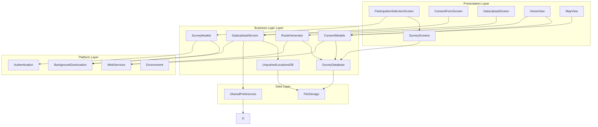
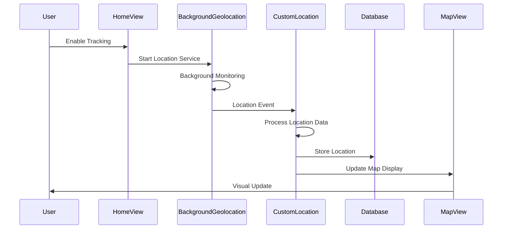
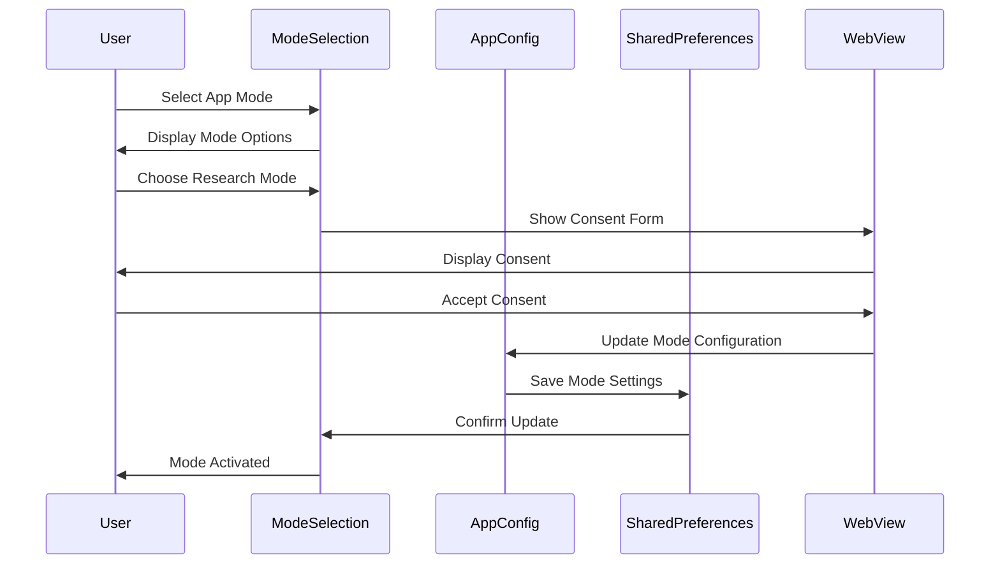

# Gauteng Wellbeing Mapper - Architecture Overview

## System Architecture Overview

Gauteng Wellbeing Mapper follows a layered architecture pattern designed for maintainability, testability, and scalability. The application is built using Flutter and implements a clean separation of concerns to support mental wellbeing mapping in environmental & climate context as part of the Planet4Health research project.

The architecture includes research participation with end-to-end encryption for secure data transmission from participants' phones to researchers in South Africa.

## Architectural Layers

### 1. Presentation Layer (`ui/`)
The presentation layer handles all user interface components and user interactions.

#### Key Components:
- **HomeView**: Main application screen with location tracking controls
- **MapView**: Interactive map displaying location history  
- **ListView**: Chronological list of recorded locations
- **ParticipationSelectionScreen**: Three-way research participation selection
- **ConsentFormScreen**: Dynamic site-specific consent forms
- **DataUploadScreen**: Encrypted research data upload interface
- **Survey Screens**: Site-specific survey interfaces
- **WebView**: Survey and external content integration

#### Responsibilities:
- User interface rendering
- User input handling
- State management for UI components
- Navigation between screens
- Research participation workflow management

### 2. Business Logic Layer (`models/`, `services/`)
This layer contains the application's business rules and data processing logic.

#### Key Components:
- **RouteGenerator**: Application navigation and routing
- **CustomLocation**: Location data processing and management
- **DataUploadService**: Encrypted data transmission service
- **ConsentModels**: Research consent and participation management
- **SurveyModels**: Site-specific survey data structures
- **LocationManager**: Location tracking coordination

#### Responsibilities:
- Data validation and processing
- Encryption and security operations
- Business rule implementation
- Service coordination
- Multi-site research logic
- Upload scheduling and synchronization

### 3. Data Layer (`db/` and `models/`)
The data layer manages all data persistence and retrieval operations.

#### Key Components:
- **SurveyDatabase**: Enhanced SQLite database with location tracking
- **Model Classes**: Data structure definitions with encryption support
- **Storage Services**: File and preference management
- **LocationTrack**: Location data for research uploads

#### Responsibilities:
- Data persistence with encryption support
- Database operations for surveys and location tracking
- Local data synchronization
- Data model definitions
- Cache management

### 4. Platform Layer (`util/` and platform services)
This layer handles platform-specific functionality and external service integration.

#### Key Components:
- **Background Geolocation**: Native location tracking
- **Authentication Services**: User identification  
- **Environment Configuration**: App settings
- **External APIs**: Third-party service integration

#### Responsibilities:
- Platform-specific operations
- External service communication
- Background processing
- Hardware abstraction

## Security & Encryption Architecture

### Hybrid Encryption System
The app implements a sophisticated encryption system for secure research data transmission.

#### Encryption Components:
- **DataUploadService**: Core encryption and upload coordination
- **ServerConfig**: Research site configuration with embedded public keys
- **EncryptionResult**: Encryption operation results and metadata
- **LocationTrack**: Location data structures for research uploads

#### Security Features:
- **RSA-4096 Public Key Cryptography**: Asymmetric encryption for key exchange
- **AES-256-GCM**: Symmetric encryption for data payload (authenticated encryption)
- **Unique Session Keys**: Fresh AES key generated for each upload
- **Site Isolation**: Secure encryption for research data


## Component Interaction Diagram



## Data Flow Architecture

### Location Tracking Flow



### App Mode Selection Flow



## Performance Considerations

### Location Tracking Optimization
- **Smart Sampling**: Adjust location frequency based on movement
- **Battery Management**: Optimize GPS usage for battery life
- **Memory Management**: Limit in-memory location history
- **Background Limits**: Respect platform background execution limits

### Database Optimization
- **Indexing**: Proper database indexes for common queries
- **Pagination**: Limit query results to prevent memory issues
- **Cleanup**: Regular cleanup of old location data
- **Transactions**: Batch database operations for performance

## Testing Architecture

### Testing Strategy
1. **Unit Tests**: Individual class and method testing
2. **Widget Tests**: UI component testing
3. **Integration Tests**: End-to-end workflow testing
4. **Platform Tests**: Native functionality testing

### Test Organization
```
test/
├── unit/
│   ├── models/
│   ├── services/
│   └── utils/
├── widget/
│   ├── ui/
│   └── components/
└── integration_test/
    ├── location_tracking_test.dart
    ├── project_participation_test.dart
    └── app_test.dart
```

## Deployment Architecture

### Build Configuration
- **Development**: Debug builds with verbose logging
- **Staging**: Release builds with test data
- **Production**: Optimized builds with production configuration

### Platform-Specific Considerations
- **Android**: ProGuard/R8 optimization, signing configuration
- **iOS**: App Store compliance, background execution limits
- **Cross-Platform**: Shared business logic, platform-specific UI adaptations
