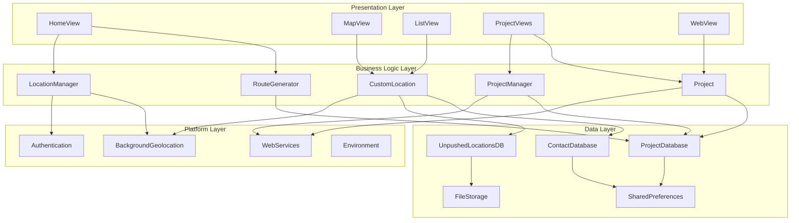

# Wellbeing Mapper - Code Architecture

## System Architecture Overview

Wellbeing Mapper follows a layered architecture pattern designed for maintainability, testability, and scalability. The application is built using Flutter and implements a clean separation of concerns to support mental wellbeing mapping in environmental & climate context as part of the Planet4Health research project.

## Architectural Layers

### 1. Presentation Layer (`ui/`)
The presentation layer handles all user interface components and user interactions.

#### Key Components:
- **HomeView**: Main application screen with location tracking controls
- **MapView**: Interactive map displaying location history
- **ListView**: Chronological list of recorded locations
- **ProjectViews**: Project management and participation interfaces
- **WebView**: Survey and external content integration

#### Responsibilities:
- User interface rendering
- User input handling
- State management for UI components
- Navigation between screens

### 2. Business Logic Layer (`models/` and core services)
This layer contains the application's business rules and data processing logic.

#### Key Components:
- **RouteGenerator**: Application navigation and routing
- **CustomLocation**: Location data processing and management
- **Project**: Research project participation logic
- **LocationManager**: Location tracking coordination

#### Responsibilities:
- Data validation and processing
- Business rule implementation
- Service coordination
- State management

### 3. Data Layer (`db/` and `models/`)
The data layer manages all data persistence and retrieval operations.

#### Key Components:
- **Database Classes**: SQLite database management
- **Model Classes**: Data structure definitions
- **Storage Services**: File and preference management

#### Responsibilities:
- Data persistence
- Database operations
- Data model definitions
- Cache management

### 4. Platform Layer (`util/` and platform services)
This layer handles platform-specific functionality and external service integration.

#### Key Components:
- **Background Geolocation**: Native location tracking
- **Authentication Services**: User identification
- **Environment Configuration**: App settings
- **External APIs**: Third-party service integration

#### Responsibilities:
- Platform-specific operations
- External service communication
- Background processing
- Hardware abstraction

## Component Interaction Diagram



## Data Flow Architecture

### Location Tracking Flow


### Project Participation Flow


## Core Classes and Their Relationships

### 1. Location Management Classes

```dart
// Core location data structure
class CustomLocation {
    String _uuid;
    String _timestamp;
    double _latitude;
    double _longitude;
    String _locality;
    String _activity;
    // ... other properties
    
    static Future<CustomLocation> createCustomLocation(var recordedLocation);
    Future<void> deleteThisLocation();
    String getFormattedTimestamp();
}

// Location collection management
class CustomLocationsManager {
    static Future<List<CustomLocation>> getLocations(int maxElements);
    static Future<void> storeLocation(CustomLocation location);
    static Future<void> removeAllCustomLocations();
}

// Simplified location for sharing
class ShareLocation {
    String timestamp;
    double latitude;
    double longitude;
    double accuracy;
    String userUUID;
}
```

### 2. Project Management Classes

```dart
// Base project structure
class Project {
    int id;
    String name;
    String summary;
    String? webUrl;
    String? projectScreen;
    String imageUrl;
    int locationSharingMethod;
    String surveyElementCode;
    
    void participate(BuildContext context, String locationHistoryJSON);
}

// Database storage for projects
class ProjectDatabase {
    static final ProjectDatabase instance;
    
    Future<Database> get database;
    Future<int> createProject(Particpating_Project project);
    Future<List<Particpating_Project>> getOngoingProjects();
    Future<void> updateProjectStatus(int projectId, String status);
}
```

### 3. Database Architecture


## Background Processing Architecture

### Headless Tasks

Wellbeing Mapper implements sophisticated background processing to ensure location tracking continues even when the app is terminated.

```dart
// Main headless task handler
void backgroundGeolocationHeadlessTask(bg.HeadlessEvent headlessEvent) async {
    switch (headlessEvent.name) {
        case bg.Event.LOCATION:
            // Process new location data
            bg.Location location = headlessEvent.event;
            await processLocationInBackground(location);
            break;
        case bg.Event.MOTIONCHANGE:
            // Handle movement state changes
            break;
        case bg.Event.GEOFENCE:
            // Handle geofence events
            break;
        // ... other event types
    }
}

// Background fetch for periodic tasks
void backgroundFetchHeadlessTask(String taskId) async {
    // Retry failed uploads
    // Perform maintenance tasks
    // Update project status
    BackgroundFetch.finish(taskId);
}
```

### State Management Pattern


## Security Architecture

### Data Protection
- **Local Storage**: All sensitive data stored locally using SQLite
- **Encryption**: User UUIDs generated using cryptographically secure methods
- **Anonymization**: Personal identifiers never shared with external services
- **User Control**: Explicit consent required for all data sharing

### Authentication Flow


## Error Handling Architecture

### Error Handling Strategy
1. **Graceful Degradation**: App continues functioning with reduced capabilities
2. **Retry Mechanisms**: Automatic retry for network failures
3. **Local Fallbacks**: Store data locally when remote services fail
4. **User Feedback**: Clear error messages and recovery options

### Error Flow


## Performance Considerations

### Location Tracking Optimization
- **Smart Sampling**: Adjust location frequency based on movement
- **Battery Management**: Optimize GPS usage for battery life
- **Memory Management**: Limit in-memory location history
- **Background Limits**: Respect platform background execution limits

### Database Optimization
- **Indexing**: Proper database indexes for common queries
- **Pagination**: Limit query results to prevent memory issues
- **Cleanup**: Regular cleanup of old location data
- **Transactions**: Batch database operations for performance

## Testing Architecture

### Testing Strategy
1. **Unit Tests**: Individual class and method testing
2. **Widget Tests**: UI component testing
3. **Integration Tests**: End-to-end workflow testing
4. **Platform Tests**: Native functionality testing

### Test Organization
```
test/
├── unit/
│   ├── models/
│   ├── services/
│   └── utils/
├── widget/
│   ├── ui/
│   └── components/
└── integration_test/
    ├── location_tracking_test.dart
    ├── project_participation_test.dart
    └── app_test.dart
```

## Deployment Architecture

### Build Configuration
- **Development**: Debug builds with verbose logging
- **Staging**: Release builds with test data
- **Production**: Optimized builds with production configuration

### Platform-Specific Considerations
- **Android**: ProGuard/R8 optimization, signing configuration
- **iOS**: App Store compliance, background execution limits
- **Cross-Platform**: Shared business logic, platform-specific UI adaptations

## Future Architecture Considerations

### Scalability
- **Cloud Integration**: Optional cloud backup and sync
- **Real-time Features**: Live location sharing for specific projects
- **Analytics**: Privacy-preserving usage analytics
- **Modular Projects**: Plugin architecture for research projects

### Technology Evolution
- **State Management**: Consider adopting Bloc or Riverpod
- **Database**: Evaluate migration to Drift for type safety
- **Background Processing**: Adapt to changing platform restrictions
- **UI Framework**: Stay current with Flutter updates and best practices
