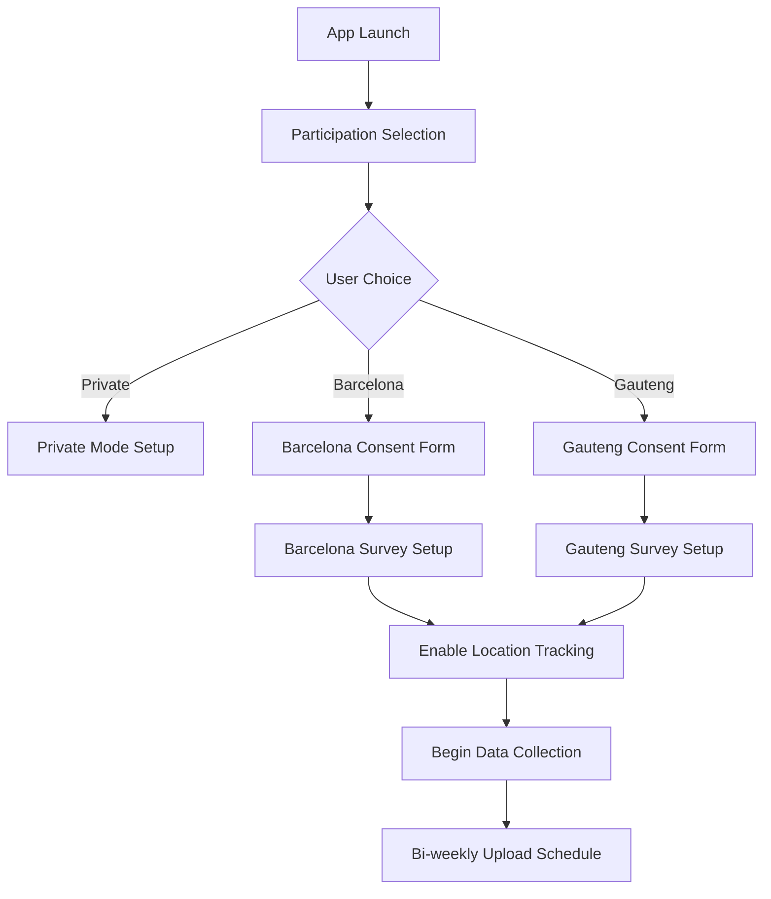
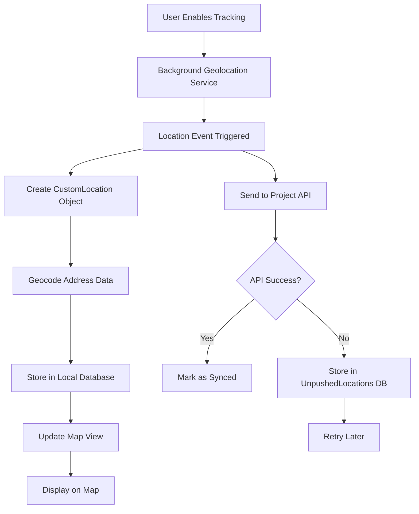
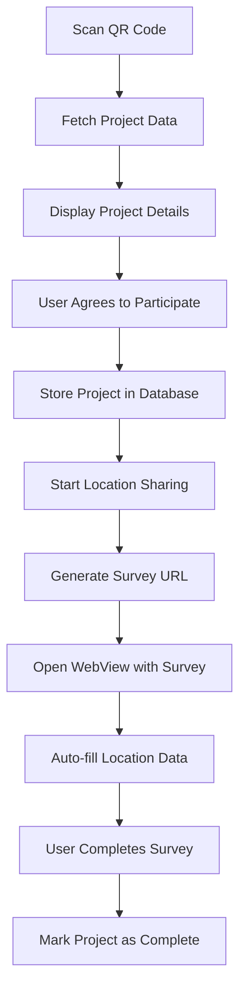
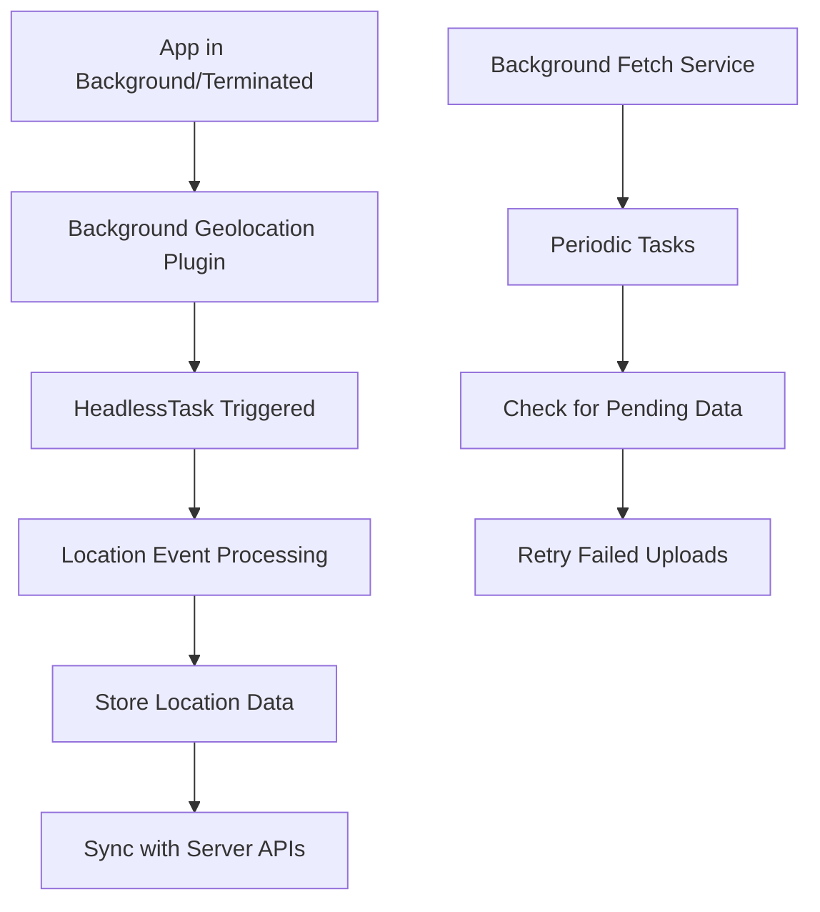

# Wellbeing Mapper - Developer Guide

## Overview

Wellbeing Mapper is a privacy-focused Flutter mobile application that enables users to map their mental wellbeing in environmental & climate context. As part of the Planet4Health project case study, the app facilitates research into how environmental and climate factors impact psychological health by allowing users to correlate location data with mental wellbeing indicators.

The app now supports **multi-site research participation** with end-to-end encryption for secure data transmission to research servers in Barcelona, Spain and Gauteng, South Africa.

### Planet4Health Integration

This application supports the Planet4Health research initiative "[Mental wellbeing in environmental & climate context](https://planet4health.eu/mental-wellbeing-in-environmental-climate-context/)", which addresses the growing recognition that environmental and climate changes contribute to mental health challenges including climate-related psychological distress.

## Table of Contents

1. [Architecture Overview](#architecture-overview)
2. [Research Participation System](#research-participation-system)
3. [Encryption & Security](#encryption--security)
4. [Core Components](#core-components)
5. [Data Flow](#data-flow)
6. [File Structure](#file-structure)
7. [Getting Started](#getting-started)
8. [Development Workflow](#development-workflow)
9. [Server Setup](#server-setup)
10. [Testing](#testing)
11. [Screenshots & Visual Documentation](#screenshots--visual-documentation)
12. [Deployment](#deployment)

## Architecture Overview

Wellbeing Mapper follows a modular Flutter architecture with clear separation of concerns:

```
┌─────────────────────────────────────────┐
│                 UI Layer                │
│  (Views, Widgets, User Interface)       │
├─────────────────────────────────────────┤
│              Business Logic             │
│   (Encryption, State, Controllers)      │
├─────────────────────────────────────────┤
│               Data Layer                │
│ (Models, Databases, Encrypted Uploads)  │
├─────────────────────────────────────────┤
│             Platform Layer              │
│  (Background Services, Native Plugins)  │
└─────────────────────────────────────────┘
```

### Key Technologies Used

- **Flutter Framework**: Cross-platform mobile development (3.27.1 required)
- **SQLite**: Local data storage with location tracking
- **RSA + AES Encryption**: Hybrid encryption for secure data transmission
- **Background Geolocation**: Location tracking when app is closed
- **WebView**: For project surveys and external content
- **SharedPreferences**: User settings and simple data storage
- **HTTP**: Encrypted data uploads to research servers

## Research Participation System

### Three Usage Modes

1. **Private Mode**: 
   - Personal mental health tracking only
   - No data sharing or transmission
   - All data stays on device

2. **Barcelona Research**:
   - Participate in Spanish research study
   - Location consent and tracking
   - Site-specific surveys and demographics
   - Encrypted bi-weekly data uploads

3. **Gauteng Research**:
   - Participate in South African research study  
   - Enhanced demographic questions (ethnicity, building type)
   - Health status tracking
   - Encrypted bi-weekly data uploads

### Participation Flow



## Encryption & Security

### Hybrid Encryption System

The app uses a two-layer encryption approach for maximum security:

1. **AES-256-GCM**: Encrypts the actual data (fast, efficient)
2. **RSA-4096-OAEP**: Encrypts the AES key (secure key exchange)

### Data Flow

```
Participant Data → JSON → AES Encrypt → RSA Encrypt Key → Base64 → HTTPS → Server
      ↓                      ↓              ↓               ↓        ↓
Survey Responses      Random AES Key   Research Team    Network   Secure Storage
Location Tracks       Per Upload       Public Key       Transit   Private Key Decrypt
```

### Security Features

- **Site Isolation**: Separate RSA key pairs for each research site
- **Forward Secrecy**: Each upload uses a unique AES key
- **Authenticated Encryption**: GCM mode prevents data tampering
- **Anonymous Identifiers**: Only UUID participant IDs, no personal data
- **Local-First**: Data encrypted before leaving device

### Key Management

Public keys are embedded in the app at build time:

```dart
// In lib/services/data_upload_service.dart
static const Map<String, ServerConfig> _serverConfigs = {
  'barcelona': ServerConfig(
    baseUrl: 'https://barcelona-server.com',
    publicKey: '''-----BEGIN PUBLIC KEY-----
    [RSA-4096 PUBLIC KEY FOR BARCELONA]
    -----END PUBLIC KEY-----''',
  ),
  'gauteng': ServerConfig(
    baseUrl: 'https://gauteng-server.com', 
    publicKey: '''-----BEGIN PUBLIC KEY-----
    [RSA-4096 PUBLIC KEY FOR GAUTENG]
    -----END PUBLIC KEY-----''',
  ),
};
```

## Core Components

### 1. Main Application (`main.dart`)
- **Purpose**: Application entry point and global configuration
- **Key Functions**:
  - `main()`: Initializes the app and global data
  - `backgroundGeolocationHeadlessTask()`: Handles location events when app is terminated
  - `backgroundFetchHeadlessTask()`: Handles background fetch operations
- **Global Data**: Manages user UUID and project participation status

### 2. Home View (`ui/home_view.dart`)
- **Purpose**: Main application screen with map view
- **Key Functions**:
  - Location tracking control (start/stop)
  - Background geolocation configuration
  - Project status management
  - Navigation to other screens
- **State Management**: Manages enabled state, location permissions

### 3. Map View (`ui/map_view.dart`)
- **Purpose**: Interactive map displaying user's location history
- **Key Functions**:
  - `_onLocation()`: Adds new location points to map
  - `_onMotionChange()`: Handles movement state changes
  - `_updateCurrentPositionMarker()`: Updates user's current position
- **Visual Elements**: Polylines for tracks, circles for locations, markers for stops

### 4. Database Management
Multiple SQLite databases handle different data types:

#### Project Database (`db/database_project.dart`)
- Stores research project information
- Manages user participation in projects
- Handles project status updates

#### Contact Database (`db/database_contact.dart`)
- Stores user contact information
- Manages form submissions

#### Unpushed Locations Database (`db/database_unpushed_locations.dart`)
- Stores locations that failed to sync to server
- Retry mechanism for failed uploads
- Data structure: `LocationToPush` model

### 5. Location Management (`models/custom_locations.dart`)
- **Purpose**: Manages location data and geocoding
- **Key Classes**:
  - `CustomLocation`: Represents a single location with metadata
  - `CustomLocationsManager`: Manages collections of locations
  - `ShareLocation`: Simplified location data for sharing
- **Key Functions**:
  - `createCustomLocation()`: Creates location from background geolocation data
  - `getLocationData()`: Reverse geocoding for addresses
  - `deleteThisLocation()`: Removes location from storage

### 6. Project Management
- **Project Model** (`models/project.dart`): Defines research project structure
- **Project Creation** (`ui/project_create.dart`): QR code scanning and project enrollment
- **Project Detail** (`ui/project_detail.dart`): Project information and participation
- **Project List** (`ui/projects_list.dart`): Available and active projects

### 7. Web Integration (`ui/web_view.dart`)
- **Purpose**: Displays project surveys and external content
- **Key Functions**:
  - Load survey URLs with location data
  - Handle form auto-filling with location history
  - Manage survey completion flow

## Data Flow

### Location Tracking Flow


### Project Participation Flow


### Background Processing Flow


## File Structure

```
```
wellbeing-mapper-app/lib/
├── main.dart                    # App entry point
├── shared_events.dart           # Event management system
├── styles.dart                  # Global styling
├── components/                  # Reusable UI components
│   ├── banner_image.dart       # Project banner images
│   └── project_tile.dart       # Project list items
├── db/                         # Database management
│   ├── database_project.dart   # Project data storage
│   ├── database_contact.dart   # Contact form storage
│   ├── database_unpushed_locations.dart # Failed sync storage
│   └── database_tiger_in_car.dart # Specific project storage
├── external_projects/          # Project-specific implementations
│   └── tiger_in_car/          # Example research project
├── models/                     # Data models
│   ├── app_localizations.dart  # Internationalization
│   ├── custom_locations.dart   # Location data models
│   ├── project.dart           # Project data model
│   ├── contacts.dart          # Contact form model
│   ├── locations_to_push.dart # Sync queue model
│   └── route_generator.dart    # Navigation routing
├── services/                   # Business logic services
│   └── notification_service.dart # Survey reminder system
├── ui/                        # User interface screens
│   ├── home_view.dart         # Main screen
│   ├── map_view.dart          # Interactive map
│   ├── list_view.dart         # Location history list
│   ├── notification_settings_view.dart # Notification preferences
│   ├── project_create.dart    # QR scanning & enrollment
│   ├── project_detail.dart    # Project information
│   ├── projects_list.dart     # Available projects
│   ├── side_drawer.dart       # Navigation menu
│   ├── web_view.dart          # Survey web view
│   ├── form_view.dart         # Contact forms
│   └── report_issues.dart     # Bug reporting
├── util/                      # Utility functions
│   ├── env.dart              # Environment configuration
│   ├── dialog.dart           # Dialog utilities
│   └── spacemapper_auth.dart # Authentication services
└── mocks/                     # Test data and mocking
    └── mock_project.dart      # Mock project data
```

## Key Features

### 1. Location Tracking
- **Real-time tracking**: Continuous location monitoring
- **Battery optimization**: Intelligent sampling and motion detection
- **Offline storage**: All data stored locally first
- **Privacy-focused**: No data shared without explicit consent

### 2. Project Participation
- **QR code enrollment**: Easy project joining via QR codes
- **Data sharing control**: Users choose what and when to share
- **Survey integration**: Seamless connection to research surveys
- **Multiple projects**: Support for simultaneous project participation

### 3. Data Management
- **Local-first**: All data stored on device
- **Selective sharing**: Granular control over data sharing
- **Export capabilities**: JSON export for data portability
- **Retry mechanisms**: Automatic retry for failed uploads

### 4. User Interface
- **Interactive map**: Real-time location visualization
- **Location history**: Chronological list of visits
- **Project management**: Easy enrollment and status tracking
- **Multi-language**: Support for multiple languages

### 5. Notification System
- **Survey reminders**: Automated 2-week recurring prompts
- **Background scheduling**: Uses existing background_fetch infrastructure
- **User preferences**: Settings for enabling/disabling notifications
- **Statistics tracking**: Monitor notification frequency and user engagement

## Getting Started

### Prerequisites
- **Flutter SDK**: 3.27.1 (required - use FVM for version management)
- **Dart SDK**: 3.6.0 (included with Flutter)
- **Android Studio / Xcode**: For platform-specific development
- **Device with location services**: GPS capability required
- **OpenSSL**: For generating encryption keys (research setup)

### Quick Start

```bash
# Install FVM for Flutter version management
dart pub global activate fvm

# Clone the repository
git clone [repository-url]
cd wellbeing-mapper-app/wellbeing-mapper-app

# Use correct Flutter version
fvm use 3.27.1

# Install dependencies
fvm flutter pub get

# Run the app
fvm flutter run
```

### Configuration

#### 1. Environment Setup
Configure `util/env.dart` with appropriate server URLs and settings.

#### 2. Permissions
Ensure location permissions are properly configured in platform files:
- **Android**: `android/app/src/main/AndroidManifest.xml`
- **iOS**: `ios/Runner/Info.plist`

#### 3. Research Server Setup (For Research Teams)

**Generate RSA Key Pairs:**
```bash
# For Barcelona research site
openssl genrsa -out barcelona_private_key.pem 4096
openssl rsa -in barcelona_private_key.pem -pubout -out barcelona_public_key.pem

# For Gauteng research site  
openssl genrsa -out gauteng_private_key.pem 4096
openssl rsa -in gauteng_private_key.pem -pubout -out gauteng_public_key.pem
```

**Update App Configuration:**
Edit `lib/services/data_upload_service.dart` and replace the placeholder public keys:

```dart
static const Map<String, ServerConfig> _serverConfigs = {
  'barcelona': ServerConfig(
    baseUrl: 'https://your-barcelona-server.com',
    uploadEndpoint: '/api/v1/participant-data',
    publicKey: '''-----BEGIN PUBLIC KEY-----
[PASTE YOUR BARCELONA PUBLIC KEY HERE]
-----END PUBLIC KEY-----''',
  ),
  'gauteng': ServerConfig(
    baseUrl: 'https://your-gauteng-server.com',
    uploadEndpoint: '/api/v1/participant-data', 
    publicKey: '''-----BEGIN PUBLIC KEY-----
[PASTE YOUR GAUTENG PUBLIC KEY HERE]
-----END PUBLIC KEY-----''',
  ),
};
```

**Rebuild App:**
```bash
fvm flutter clean
fvm flutter pub get
fvm flutter build apk --release
```

#### 4. Server Setup
For detailed server setup instructions, see:
- [Server Setup Guide](SERVER_SETUP.md)
- [Encryption Configuration Guide](ENCRYPTION_SETUP.md)

## Server Setup

### Research Data Collection Server

Each research site requires a secure HTTPS server with:

1. **REST API endpoint** for encrypted data uploads
2. **Private key storage** for data decryption  
3. **Database** for storing encrypted participant data
4. **Processing pipeline** for decrypting and analyzing data

### Minimum Server Requirements
- **OS**: Ubuntu 20.04 LTS or equivalent
- **RAM**: 8GB recommended
- **Storage**: 100GB minimum (SSD recommended)
- **SSL Certificate**: Valid HTTPS certificate
- **Database**: PostgreSQL 13+ or MongoDB 4.4+

### API Endpoint Implementation

**Node.js Example:**
```javascript
app.post('/api/v1/participant-data', async (req, res) => {
  const { uploadId, participantUuid, researchSite, encryptedData, encryptionMetadata } = req.body;
  
  try {
    // Store encrypted data (cannot be read without private key)
    await database.storeEncryptedUpload({
      uploadId,
      participantUuid,
      researchSite,
      encryptedPayload: encryptedData,
      metadata: encryptionMetadata,
      receivedAt: new Date()
    });
    
    res.json({ 
      success: true, 
      uploadId: uploadId,
      message: 'Data received and stored securely' 
    });
  } catch (error) {
    res.status(500).json({ success: false, error: 'Upload failed' });
  }
});
```

For complete server implementation, see [Server Setup Guide](SERVER_SETUP.md).

## Development Workflow

### Adding New Features
1. **Model First**: Define data models in `models/` directory
2. **Database Layer**: Add database operations in `db/` directory
3. **Business Logic**: Implement logic in appropriate service classes
4. **UI Implementation**: Create UI components in `ui/` directory
5. **Integration**: Wire everything together through state management

### Location Feature Development
```dart
// Example: Adding a new location-based feature
class CustomLocationService {
  // 1. Define the data model
  static Future<CustomLocation> processLocation(bg.Location rawLocation) async {
    // Process raw location data
    CustomLocation location = await CustomLocation.createCustomLocation(rawLocation);
    
    // 2. Store in database
    await CustomLocationsManager.storeLocation(location);
    
    // 3. Update UI
    NotificationCenter.broadcast('location_updated', location);
    
    return location;
  }
}
```

### Project Integration Development
```dart
// Example: Adding a new research project
class NewProjectIntegration extends Project {
  @override
  void participate(BuildContext context, String locationData) {
    // 1. Configure project-specific parameters
    Map<String, String> projectConfig = {
      'projectId': 'new_project_001',
      'dataFormat': 'custom',
      'requiredFields': 'lat,lng,timestamp'
    };
    
    // 2. Process location data according to project requirements
    String processedData = processLocationData(locationData, projectConfig);
    
    // 3. Launch project interface
    Navigator.pushNamed(context, '/new_project_interface', 
        arguments: {'data': processedData, 'config': projectConfig});
  }
}
```

## Testing

### Unit Tests (`test/unit/`)
- Model validation
- Database operations
- Utility functions
- Business logic

### Widget Tests (`test/widget/`)
- UI component testing
- User interaction testing
- State management testing

### Integration Tests (`integration_test/`)
- End-to-end workflow testing
- Location tracking scenarios
- Project participation flows

### Running Tests
```bash
# Unit tests
flutter test test/unit/

# Widget tests
flutter test test/widget/

# Integration tests
flutter test integration_test/
```

## Screenshots & Visual Documentation

### Automated Screenshot System

The app includes a comprehensive screenshot system for documenting the user interface and generating visual documentation. This system is particularly useful for:

- **Feature Documentation**: Visual guides for new developers
- **QA Testing**: Verifying UI consistency across updates
- **Research Documentation**: Screenshots for research team reports
- **App Store Materials**: Generating store listing screenshots

### Quick Start

Generate screenshots using the automated system:

```bash
# Show instructions and setup environment
./generate_screenshots.sh

# Manual screenshot capture workflow
./generate_screenshots.sh --manual

# Automated capture (experimental)
./generate_screenshots.sh --automated

# Show detailed capture instructions
./generate_screenshots.sh --instructions
```

### Key Features Captured

The screenshot system documents all major app workflows:

1. **🔘 Participation Selection**: Private, Barcelona, and Gauteng research modes
2. **📝 Survey Interface**: Site-specific surveys and form interactions
3. **🗺️ Map Views**: Location tracking and visualization
4. **⚙️ Settings**: Data upload, privacy controls, and configuration
5. **📊 Data Management**: Upload status and encryption indicators
6. **ℹ️ Information Screens**: Consent forms, privacy policy, help

### Screenshot Organization

Screenshots are automatically organized into:
- `screenshots/manual/` - Manually captured screenshots
- `screenshots/automated/` - Automated capture results
- `screenshots/organized/` - Auto-organized by type and date
- `screenshots/report.html` - Interactive HTML report

### Integration with Development

The screenshot system integrates with the development workflow:

```bash
# Capture screenshots after feature implementation
./generate_screenshots.sh --automated

# Update visual documentation
git add screenshots/
git commit -m "Update app screenshots for new feature"
```

For detailed instructions and advanced usage, see [`screenshots/README.md`](../screenshots/README.md).

## Deployment

### Android Deployment
1. Configure `android/key.properties` with signing keys
2. Build release APK: `flutter build apk --release`
3. Build App Bundle: `flutter build appbundle --release`

### iOS Deployment
1. Configure signing in Xcode
2. Build for release: `flutter build ios --release`
3. Archive and upload through Xcode

### CI/CD Pipeline
The project includes GitHub Actions workflows:
- **CI Tests**: Automated testing on pull requests
- **Drive Tests**: Platform-specific integration testing
- **Code Coverage**: Coverage reporting via Codecov

## Privacy Considerations

Wellbeing Mapper is designed with privacy as a core principle:

1. **Local Storage**: All location data is stored locally by default
2. **Explicit Consent**: Users must explicitly agree to share data
3. **Anonymization**: Shared data uses random UUIDs, not personal identifiers
4. **User Control**: Users can delete their data at any time
5. **Transparency**: Clear information about what data is collected and how it's used

## Troubleshooting

### Common Issues

**Location Not Updating**:
- Check location permissions
- Verify background app refresh is enabled
- Check battery optimization settings

**Project QR Code Not Working**:
- Ensure camera permissions are granted
- Verify QR code contains valid project URL
- Check network connectivity

**Data Not Syncing**:
- Check internet connectivity
- Verify server endpoints in configuration
- Check unpushed locations database for failed requests

### Debug Mode
Enable debug mode by setting `debug: true` in background geolocation configuration to see detailed logging.

## Notification System

### Overview
The notification system provides recurring survey reminders to encourage user participation in research studies. It uses the existing `background_fetch` infrastructure for scheduling and manages notifications through in-app dialogs.

### Architecture

```
┌─────────────────────────────────────────┐
│         NotificationService            │
│  - Schedule management                  │
│  - Timing checks                       │
│  - User preference handling            │
├─────────────────────────────────────────┤
│         BackgroundFetch                │
│  - Periodic execution                  │
│  - Headless operation                  │
│  - Cross-platform scheduling          │
├─────────────────────────────────────────┤
│         SharedPreferences              │
│  - Notification timestamps             │
│  - User preferences                    │
│  - Statistics storage                  │
└─────────────────────────────────────────┘
```

### Key Components

#### 1. NotificationService
- **Location**: `lib/services/notification_service.dart`
- **Purpose**: Manages all notification-related functionality
- **Features**:
  - 2-week interval scheduling
  - Background timing checks
  - User preference management
  - Statistics tracking

#### 2. Background Integration
- **Task ID**: `com.wellbeingmapper.survey_notification`
- **Frequency**: Checked hourly via background_fetch
- **Persistence**: Survives app termination and device restarts

#### 3. User Interface
- **Settings Screen**: `lib/ui/notification_settings_view.dart`
- **In-app Dialogs**: Triggered when app opens with pending notifications
- **Navigation**: Accessible through side drawer menu

### Implementation Details

#### Scheduling Logic
```dart
// Check every hour for notification timing
await BackgroundFetch.scheduleTask(TaskConfig(
  taskId: 'com.wellbeingmapper.survey_notification',
  delay: 3600000, // 1 hour in milliseconds
  periodic: true,
  // ... other configuration
));
```

#### Notification Flow
1. Background task executes hourly
2. Checks time since last notification
3. If ≥14 days, sets pending prompt flag
4. When app opens, checks for pending prompts
5. Shows survey dialog if prompt is pending

#### Data Storage
- `last_survey_notification`: Timestamp of last notification
- `survey_notification_count`: Total notifications sent
- `pending_survey_prompt`: Flag for pending notifications

### Usage Examples

#### Initialize Service
```dart
// In main.dart
await NotificationService.initialize();
```

#### Check for Pending Prompts
```dart
// In home_view.dart initState
bool hasPendingPrompt = await NotificationService.hasPendingSurveyPrompt();
if (hasPendingPrompt) {
  await NotificationService.showSurveyPromptDialog(context);
}
```

#### User Preference Management
```dart
// Enable notifications
await NotificationService.enableNotifications();

// Disable notifications
await NotificationService.disableNotifications();

// Reset schedule
await NotificationService.resetNotificationSchedule();
```

### Testing

#### Trigger Notification Manually
Use the notification settings screen to trigger a survey prompt immediately for testing purposes.

#### Reset Schedule
Reset the notification schedule through settings to test first-time user experience.

#### Background Testing
Test background functionality by:
1. Triggering background fetch manually
2. Checking SharedPreferences for updated timestamps
3. Verifying prompt appears on next app launch

### Configuration

#### Notification Interval
```dart
static const int _notificationIntervalDays = 14; // 2 weeks
```

#### Background Task Frequency
```dart
delay: 3600000, // Check every hour
```

### Future Enhancements
- Push notifications for better user engagement
- Customizable notification intervals
- A/B testing for different notification strategies
- Rich notification content with action buttons

## Contributing

1. Fork the repository
2. Create a feature branch
3. Make your changes
4. Run tests: `flutter analyze && flutter test`
5. Submit a pull request

For more information, see the main [README.md](../README.md) file.
