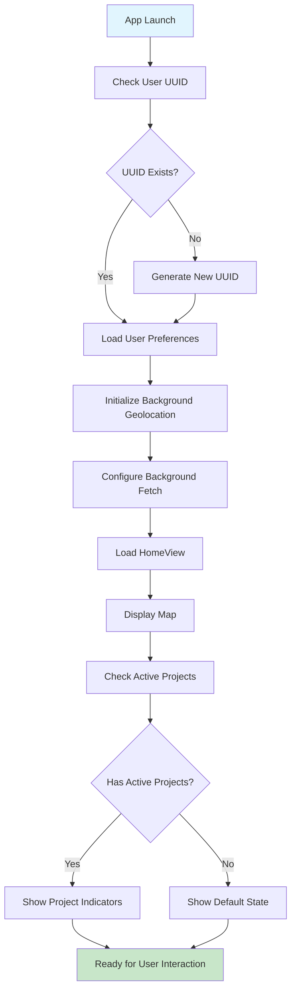
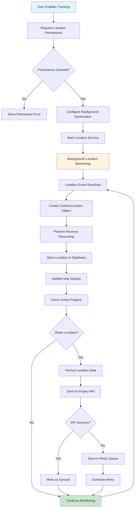
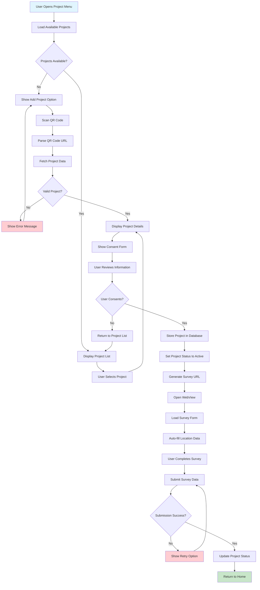
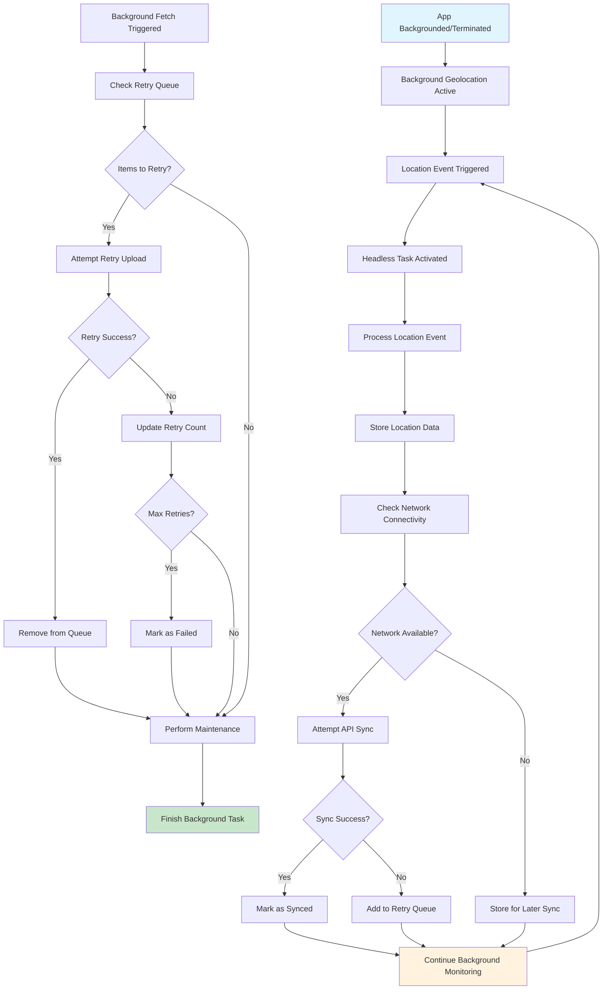
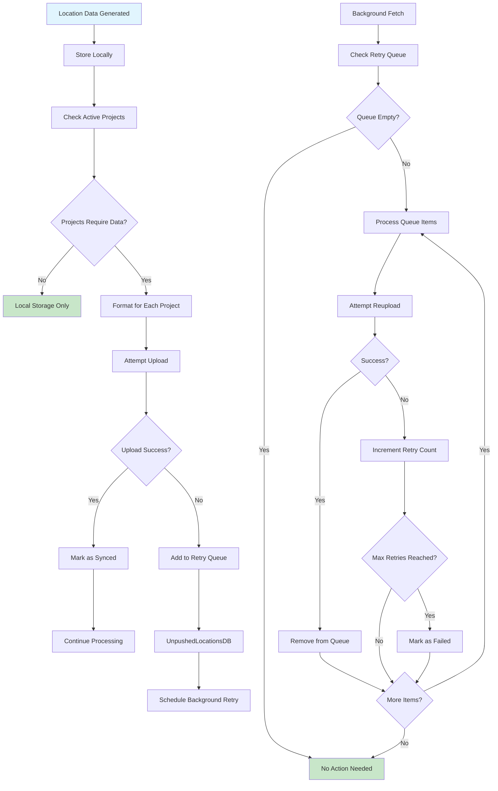
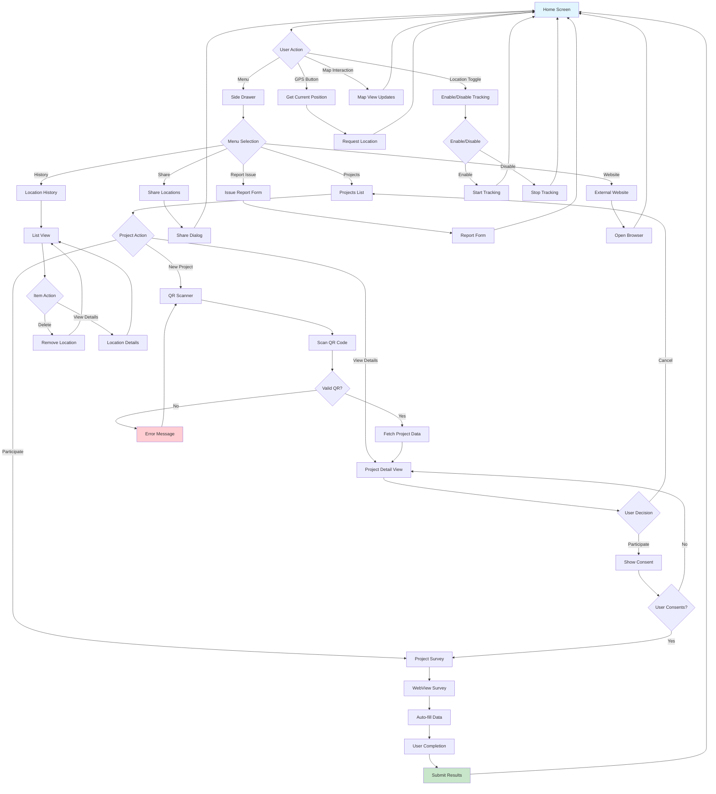
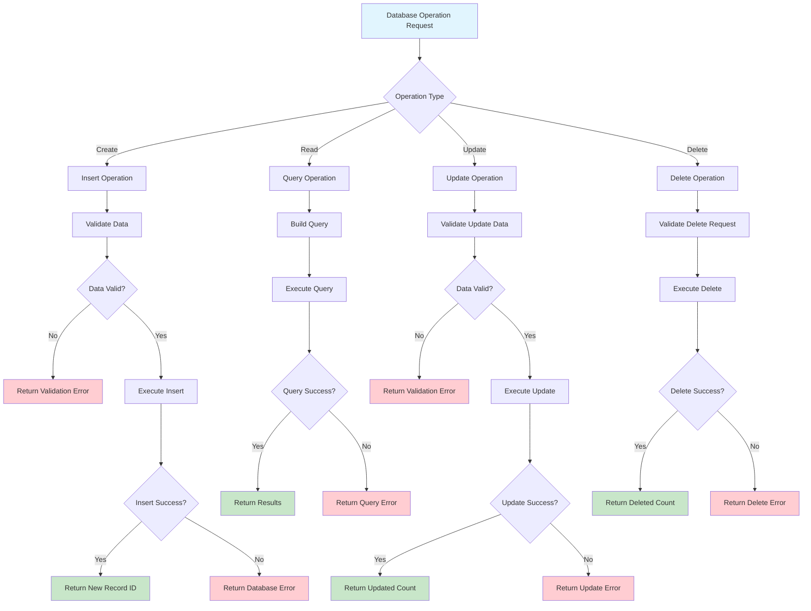
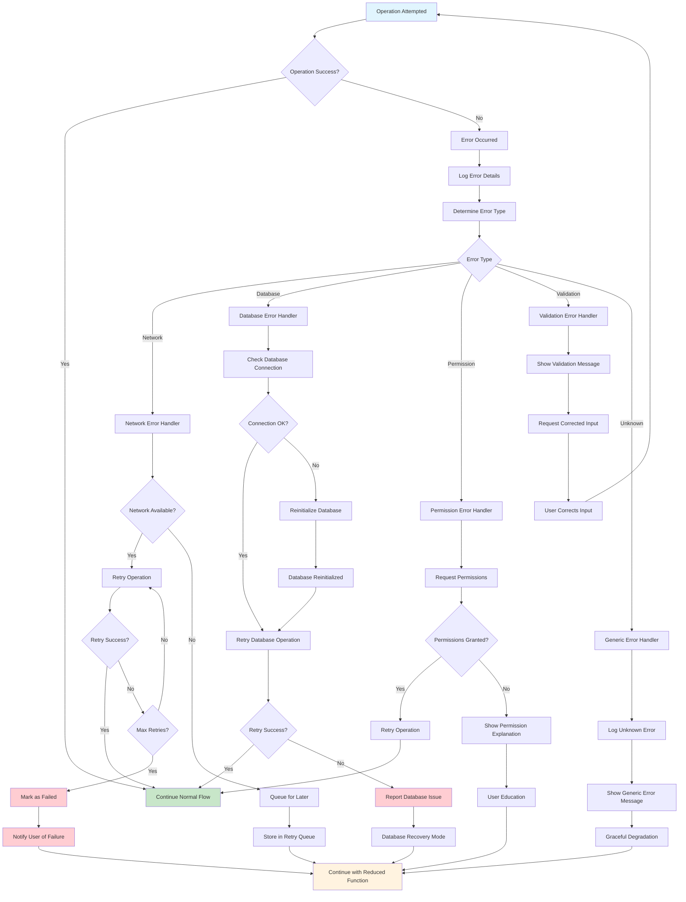
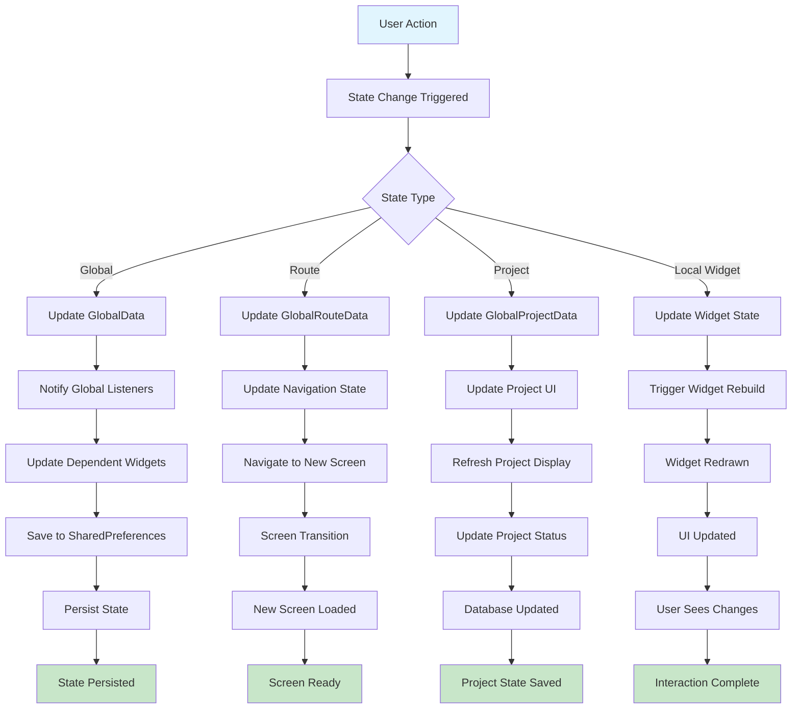
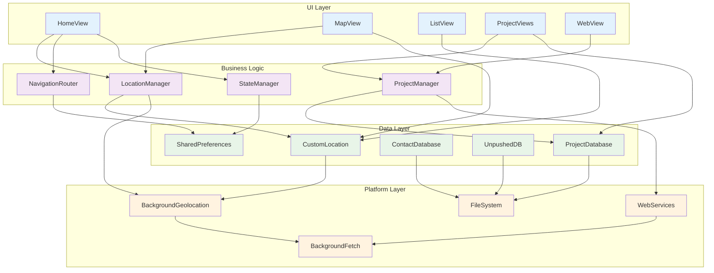

# Wellbeing Mapper - Flow Charts and Diagrams

## Application Flow Overview

This document contains detailed flow charts and diagrams to help developers understand how different components of Wellbeing Mapper interact with each other to support mental wellbeing mapping in environmental & climate context as part of the Planet4Health research project.

## Main Application Flow

## Location Tracking Flow

## Project Participation Flow

## Background Processing Flow

## Data Synchronization Flow

## User Interface Navigation Flow

## Database Operations Flow

## Error Handling Flow

## State Management Flow

## Component Interaction Diagram

These flow charts and diagrams provide a comprehensive visual guide to understanding how Wellbeing Mapper components interact and how data flows through the system. They serve as a reference for developers to quickly understand the application's behavior and identify integration points for new features.
